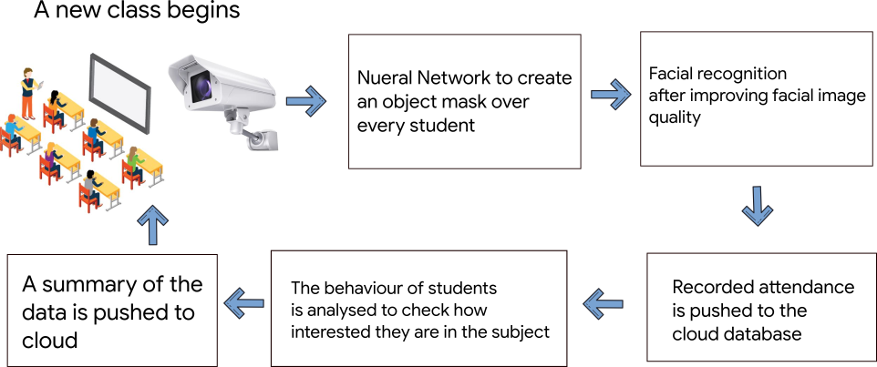

# Omniscient Eye
A model which checks whether students are paying attention to the lecture or not. Creepy? yeah.

  

  

## Abstract

The primary aim of this application is to be able to record the attendance of students inside a classroom without having to rollcall each student individually and updload the attendance data to the cloud so that a backup is maintained at all times and is easily accessible from any device with an internet connection and required permissions.
This application also aims to reduce the load of taking attendance manually inside a class and helps the teacher record the behaviour of the students to infer how effective the lecture is. The application provides the teacher with an insight into his own teaching patterns and habits which will the teacher to rectify any issues that may be a cause of the student's disinterest in the subject.

## Problem Statement

Conventional attendance system followed in an educational system where the teacher calls out the name of each and every student and marks the attendance causes time wastage during lecture time. This becomes more and more severe especially in the current scenario where number of students in a class is very large. Managing the attendance data of such a large group is also very difficult. Another disadvantage of present system is the chance for the student to mark fake attendance.
Morover the teacher is unable to determine exactly how many students do not have any interest in the lecture or how boring the lecture itself is.

## Proposed Work

To avoid wastage of valuable lecture time inside a class that usually gets spent on taking attendance and evaluating if their are any falacies in the roll calls and to provide the teacher with a summary of how many students are interested in the subject lecture which will help the teacher to improve the quality of teh lecture if need be which will greatly improve the performance of the students in the examinations of their respective subjects.

 

## Flow Chart

  

Convolutional Neural Network (CNN), a branch of deep learning architectures and a part of Machine Learning, was used as a method in this application. The experiments were conducted through several stages such as face detection, image improvement and model formation.

- First, snaps of the classroom after every 10 mins are analysed and used for facial recognition. The faces recognized in the majority of the images are provided with the attendance. If someone were to attend only the first half of the class and then ditch the rest, then he wont recieve any attendance. The attendance is then fed to the database hosted on the cloud.

- The next step is to predict or guess the behaviour of the students in the class by detecting the emotions on the faces of the students and analysing the skeletal poses of the students. This analysis helps us to review the lecture of the subject being taught and provide the lecturer with a result of how many students were interested in the class and an average interactivity factor of the classroom.

- It is made sure that the data predicted by the model at any point of the process is kept anonymous. If the teacher asks for a disclosure then he can be provided with the data after taking permission form the concerned authorities.

## Existing Work

1. [face_recognition](https://github.com/ageitgey/face_recognition): The world's simplest facial recognition api for Python and the command line.

2. [Mask R-CNN](https://github.com/matterport/Mask_RCNN): for object detection and instance segmentation on Keras and TensorFlow.

3. [Pose2Seg](https://github.com/liruilong940607/Pose2Seg): Detection Free Human Instance Segmentation

## Conclusion

To conclude, the primary aim of recording the attendance without any mannual intervention is achieved on an almost-satisfactory level, however this application will also help a teacher to better understand the interests of his students and help them learn and focus better in a class.

## Future Work

- We plan to implement pos2seg in your application to better predict the behaviour of the students and achieve higher accuracy while creating a mask of the students

- We aim to make the program perform on realtime speeds so that it can recieve more input data which will further improve the accuracy of the models.

- We plan to make the whole application feasible for low devices with low computing powers hence making it less resource intensive.

## Contributors

- [Debashish Mishra](https://github.com/Zanark)
- [Omm Mishra](https://github.com/ommmishra)